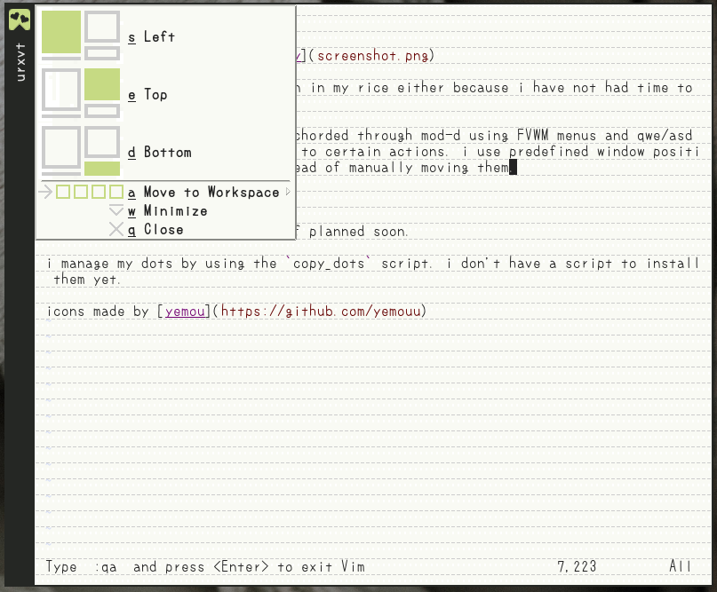

my dotfiles.

i use FVWM. some stuff is broken in my rice either because i have not had time to fix it or it is WIP.

my window manager keybinds are chorded through mod-d using FVWM menus that popup in the corner of each window and qwe/asd hotkeys as a grid to correspond to certain actions. i use predefined window positions to move windows around instead of manually moving them.

my workflow also has full mouse support. clicking the icon in the top left of a window opens the menu, and options can be selected from those menus. workspaces can be switched using the workspace widget in the bottom left.

i have a lot more workflow stuff planned soon.

i manage my dots by using the `copy_dots` script. i don't have a script to install them yet.

icons made by [yemou](https://github.com/yemouu)
